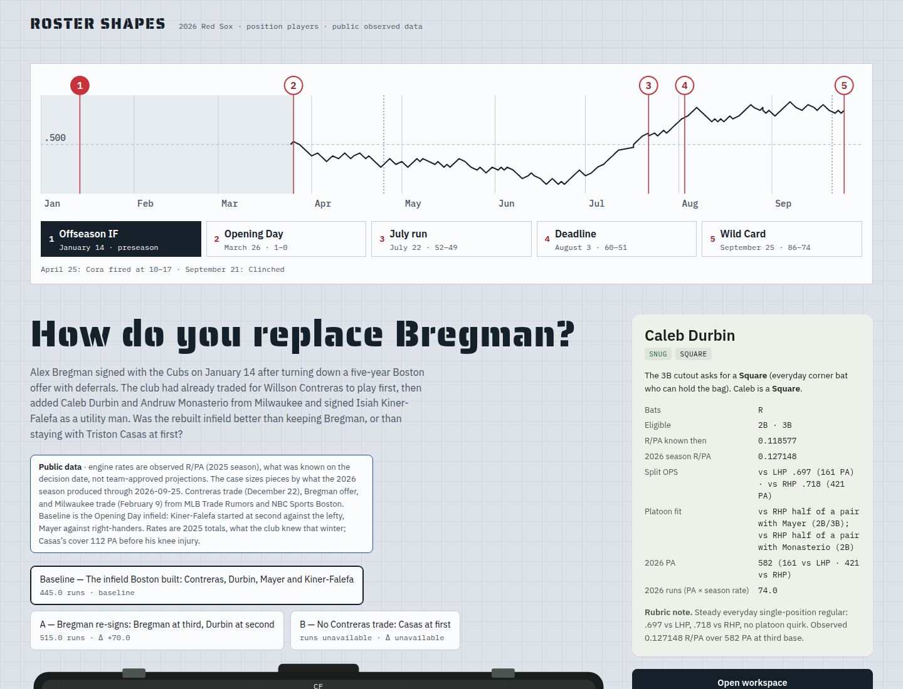
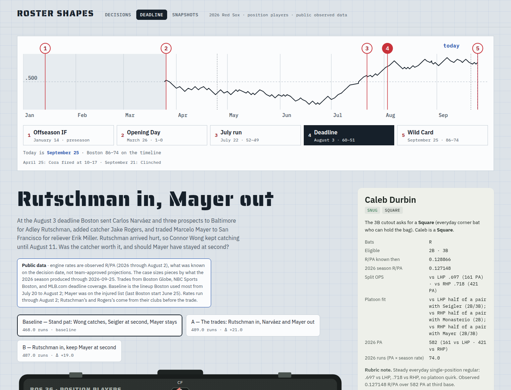

# Roster Shapes

An interactive workspace for comparing how position-player acquisitions change a
team's positional coverage, lineup options, and allocation of playing time:
one baseline roster against two candidates under shared, explicit assumptions.
Every displayed change traces to an input, an assumption, or a versioned
calculation. The app opens on an interactive roster-and-shapes graphic followed
by five 2026 Boston Red Sox comparison storylines built from cited public
observed data (no team data, no projections).

## Contents

- [Summary](#summary)
- [Demo results](#demo-results)
- [Design and architecture](#design-and-architecture)
- [Data sources](#data-sources)
- [Trying it locally](#trying-it-locally)
- [Demo deployment](#demo-deployment)
- [Repository layout](#repository-layout)
- [Status, limitations, and what's next](#status-limitations-and-whats-next)
- [License](#license)

## Summary

A baseball operations analyst loads a versioned roster snapshot, sets a
planning horizon and lineup templates, builds two acquisition scenarios against
the baseline, edits the allocation of starts and plate appearances, and
compares coverage shortfalls ("white space"), opportunity transfers, and
supported offensive contribution. Evidence drill-down separates source
evidence, assumptions/judgments, and calculated effects. Comparisons save as
drafts and export as self-contained JSON bundles that re-import with replay
verification.

The prototype is complete through the roadmap's RS-07 acceptance gate plus
follow-up gap closure: deterministic engine, versioned persistence, comparison
workspace (selectors, Swap/Move, pointer drag-and-drop, keyboard walkthrough),
import/export/replay, evidence drawer, and full axe accessibility. There is no
team partnership, approved team data, staffing, or deployment implied — see
[SPEC.md](SPEC.md) and [ROADMAP.md](ROADMAP.md).

| Document | Use it for |
| --- | --- |
| [Product specification](SPEC.md) | Scope, hypotheses, pilot plan, non-goals |
| [Development instructions](AGENTS.md) | Component reading, evidence, agent coordination |
| [Roadmap](ROADMAP.md) | Task IDs, ownership, integration gates, handoff log |
| [Domain and calculations](docs/DOMAIN_AND_CALCULATIONS.md) | Assignments, outs/PA accounting, feasibility, readiness |
| [Data contract](docs/DATA_CONTRACT.md) | Versioned records, validation, results, replay |
| [Interaction contract](docs/WORKFLOWS.md) | Screens, editing, failures, keyboard behavior |
| [Acceptance](docs/ACCEPTANCE.md) | Exact numerical cases and evaluation protocol |
| [Decisions](docs/DECISIONS.md) | Adopted defaults (D-01–D-40) and open dependencies |
| [Shape taxonomy](docs/SHAPE_TAXONOMY.md) | Analyst-labeled 8-shape rubric v1 for the roster graphic |
| [Public data sources](docs/research/2026-09-21-public-data-sources.md) | Alternative-source survey behind the spike |

## Demo results

Five runnable 2026 storyline comparisons, each baseline plus two candidates
over the same illustrative 10-game / 360-PA horizon with observed 2026 R/PA in
overall mode (splits unavailable), verified in CI-equivalent local runs
(`bun run check`, `bun run lint`, 30 Vitest tests, 17 Playwright journeys).
Rebuilt from live data with `bun spikes/mlb-2026/build.mjs`, which asserts the
hand-derived totals below before writing `src/lib/storylines/*.json`:

| Storyline | Baseline | Candidate A | Candidate B |
| --- | --- | --- | --- |
| Power vacuum (no Devers/Bregman) | 39.13 | 38.32 (−0.81) | Unavailable — Casas has no 2026 rate |
| Outfield logjam (4 gloves + DH) | 38.32 | 39.13 (+0.81) | 37.46 (−0.86) |
| Infield reset (worst to steady) | 38.32 | 39.96 (+1.64) | 39.24 (+0.92) |
| Catcher split (Narváez vs Wong) | 38.32 | 39.05 (+0.73) | 38.33 (+0.01) |
| Lefty hole (no Refsnyder/Romy) | 39.13 | 40.77 (+1.64) | 39.58 (+0.45) |

Readiness is false only on the missing transaction-rule acknowledgment;
missing rates stay missing (candidate B of the power vacuum keeps comparable
coverage with unavailable offense). The prior synthetic golden fixture and the
2025 public spike were removed under D-38; `docs/examples/comparison-v1.json`
is retained read-only as the historical v1 illustration.




**Performance**: edit-to-render p95 of **8.8 ms** against the proposed 250 ms
budget, measured on the RS-07 single-worker reference setup
(`reports/prototype/edit-latency.json`). A ten-game fixture passing is not
evidence for arbitrary workloads.

## Design and architecture

```text
Approved imports → validated, versioned snapshots
                              ↓
Scenario inputs → deterministic allocation/metric engine → comparison UI
                              ↓                              ↓
                        scenario records                evidence cards

Permitted evidence → optional Jev adapter → classification cache/review
```

Component boundaries are enforced by lint and owned exclusively per task:

- `src/lib/contracts/` — strict Zod v1 bundle validator, RFC 6901 issue paths,
  canonical SHA-256 input digests. Rejects broken references atomically;
  domain violations import as inspectable drafts.
- `src/lib/engine/` — pure deterministic calculation (`deterministic-engine-v1`):
  membership, eligibility, coverage shortfalls in integer outs, PA conservation,
  offense in integer millionths, constraints, readiness. Same inputs, identical
  results; missing values stay missing, never zero.
- `src/lib/persistence/` — versioned save/import/export with revision history,
  conflict handling (`Replace as new revision`), and replay verification
  (`REPLAY_MISMATCH` blocks review; stale results never silently override).
- `src/lib/ui/` + `src/lib/app/` — presentation only. No calculation logic in
  the UI layer; edits re-validate and recalculate the whole comparison.
- Quantitative results work without classification. The Jev experiment (RS-09)
  is optional, separately authorized, and never on the critical path.

Key invariants: adding a player never creates plate appearances; geometry never
creates coverage or value; rearranging tiles never changes a result; a saved
result replays without any future model response.

## Data sources

- **Public** (`dataClass: "public"`): fifteen 2026 Red Sox position players via
  the free MLB Stats API (no key), observed R/PA through 2026-09-20 in overall
  mode, eligibility from fielding-split games (≥10). Each storyline opens only
  after an explicit per-bundle acknowledgment ("observed public values, not
  team-approved projections"). Input digests are pinned in
  `src/lib/storylines/registry.ts`; any content change fails the suite.
- **Restricted** (`dataClass: "restricted"`): hard-blocked at import until an
  RS-08 data-owner permission record exists; the open comparison stays intact.
- No FanGraphs content is included or scraped — platoon splits would need a
  membership export its owner has not provided.

## Trying it locally

Prerequisites: Bun 1.4.2, Node 26.x, Python 3.12 (see `mise.toml`).

```sh
bun install --frozen-lockfile
bun run dev        # local dev server
bun run check      # svelte-check, zero warnings
bun run lint       # prettier + eslint
bunx vitest run --project server --project integration
bun run build
bun run test:e2e   # production build + Playwright (Chromium)
```

To open a storyline: `bun run dev`, open the app, pick a roster on the
interactive graphic (position lanes show each player's shape and workload),
then open one of the five storyline cards and confirm its public-data
acknowledgment. Declining keeps the library. To rebuild the bundles from live
2026 data: `bun spikes/mlb-2026/build.mjs` (asserts the hand-derived totals,
then writes `src/lib/storylines/*.json`; run `prettier --write` on the
regenerated JSON and rerun the suite — the pinned digests fail until reviewed).

Note: `bun run test` also contains a browser-component project that hangs in
frame-less headless Chromium; the Playwright journeys cover that surface
instead (see RS-07 limitations in ROADMAP.md).

## Demo deployment

Pushes to `main` build on GitHub Actions (`.github/workflows/deploy-demo.yml`:
install → `bun run check` → `bun run build`) and deploy `build/` to the
`jev-roster-shapes` Cloudflare Pages project. Pull requests and manual runs
produce preview deployments with their own URLs.

One-time setup (account owner):

1. Create an API token (Cloudflare Dashboard → My Profile → API Tokens) with
   the **Cloudflare Pages → Edit** permission.
2. Add repo secrets (Settings → Secrets and variables → Actions):
   `CLOUDFLARE_API_TOKEN` and `CLOUDFLARE_ACCOUNT_ID`.
3. Push to `main`. The first deploy provisions the Pages project and prints
   its `*.pages.dev` URL.

Until the secrets exist, the deploy step fails while install/check/build still
validate the change. Only public storyline content ships; this does not
satisfy the RS-08/RS-10 team-data, access-control, or retention prerequisites
(O-05 stays open), and browser drafts stay per-device.

## Repository layout

```text
src/lib/{contracts,storylines,shapes,engine,persistence,ui}/  component sources
src/lib/app/  library page, roster graphic, workspace wiring (HomePage, view model)
src/routes/   SvelteKit single-page shell
tests/{contracts,storylines,engine,persistence,integration,e2e}/  checks
spikes/mlb-2026/  2026 storyline bundle builder (script + checked-in bundles live in src)
spikes/mlb-public/  retired 2025 spike (script + notes retained; output removed under D-38)
docs/  contracts, decisions, shape rubric, research, historical example bundle
reports/prototype/  measured latency evidence
```

## Status, limitations, and what's next

Complete: RS-01 through RS-07 acceptance gates, plus import-from-file,
Swap/Move controls, drag-and-drop, keyboard walkthrough, full axe audit,
data-class gate, and — under D-38 through D-40 — the library-first revision:
interactive roster-and-shapes graphic, analyst-labeled 8-shape rubric v1, and
five 2026 public storyline comparisons replacing the retired synthetic golden
fixture and 2025 spike. Everything is verified against the contracts; see the
[roadmap handoff](ROADMAP.md#implementation-handoff) for observed commands and
per-task limitations. Shape labels are assumptions, never calculation inputs;
evaluator agreement on the taxonomy (O-03) stays open.

Not claimed: team partnership, approved data, pilot staffing, model
performance, deployment, or any outcome-study result. RS-08 (permissions,
staffing, study plan), RS-09 (optional classification experiment), and RS-10
(outcome study) each wait on people, permissions, or external decisions.
Platoon splits await a FanGraphs membership export; touch drag is out of scope.

## License

MIT — see [LICENSE](LICENSE). Underlying public baseball data carries its own
terms (MLBAM copyright notice; FanGraphs private non-commercial use;
Retrosheet attribution), recorded per-source in each bundle.
