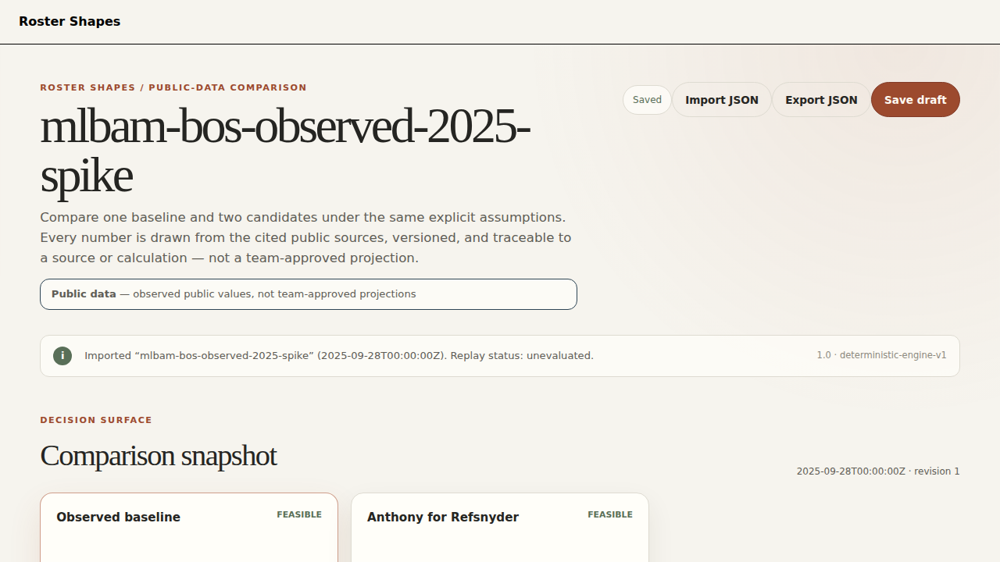
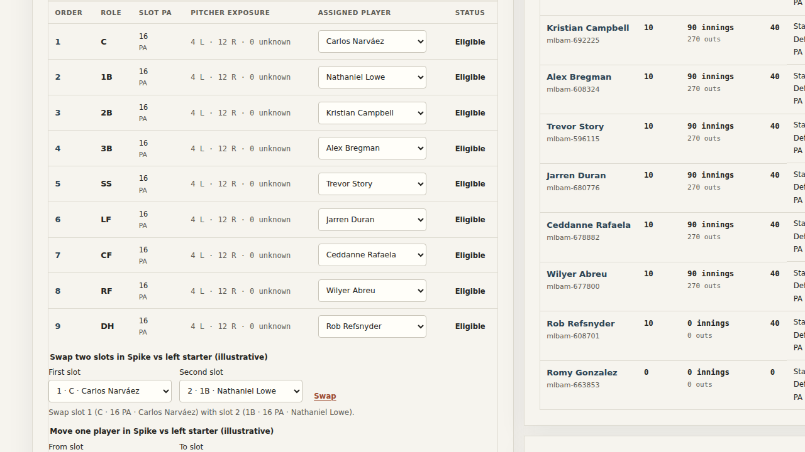

# Roster Shapes

An interactive workspace for comparing how position-player acquisitions change a
team's positional coverage, lineup options, and allocation of playing time:
one baseline roster against two candidates under shared, explicit assumptions.
Every displayed change traces to an input, an assumption, or a versioned
calculation. Built as a local prototype around clearly labeled synthetic data,
with a working public-data path demonstrated end to end.

## Contents

- [Summary](#summary)
- [Demo results](#demo-results)
- [Design and architecture](#design-and-architecture)
- [Data sources](#data-sources)
- [Trying it locally](#trying-it-locally)
- [Repository layout](#repository-layout)
- [Status, limitations, and what's next](#status-limitations-and-whats-next)
- [License](#license)

## Summary

A baseball operations analyst loads a versioned roster snapshot, sets a
planning horizon and lineup templates, builds two acquisition scenarios against
the baseline, edits the allocation of starts and plate appearances, and
compares coverage shortfalls ("white space"), opportunity transfers, and
supported offensive contribution. Evidence drill-down separates source
evidence, assumptions/judgments, and calculated effects. Comparisons save as
drafts and export as self-contained JSON bundles that re-import with replay
verification.

The prototype is complete through the roadmap's RS-07 acceptance gate plus
follow-up gap closure: deterministic engine, versioned persistence, comparison
workspace (selectors, Swap/Move, pointer drag-and-drop, keyboard walkthrough),
import/export/replay, evidence drawer, and full axe accessibility. There is no
team partnership, approved team data, staffing, or deployment implied — see
[SPEC.md](SPEC.md) and [ROADMAP.md](ROADMAP.md).

| Document | Use it for |
| --- | --- |
| [Product specification](SPEC.md) | Scope, hypotheses, pilot plan, non-goals |
| [Development instructions](AGENTS.md) | Component reading, evidence, agent coordination |
| [Roadmap](ROADMAP.md) | Task IDs, ownership, integration gates, handoff log |
| [Domain and calculations](docs/DOMAIN_AND_CALCULATIONS.md) | Assignments, outs/PA accounting, feasibility, readiness |
| [Data contract](docs/DATA_CONTRACT.md) | Versioned records, validation, results, replay |
| [Interaction contract](docs/WORKFLOWS.md) | Screens, editing, failures, keyboard behavior |
| [Acceptance](docs/ACCEPTANCE.md) | Exact numerical cases and evaluation protocol |
| [Decisions](docs/DECISIONS.md) | Adopted defaults (D-01–D-36) and open dependencies |
| [Public data sources](docs/research/2026-09-21-public-data-sources.md) | Alternative-source survey behind the spike |

## Demo results

Two runnable demonstrations, both verified in CI-equivalent local runs
(`bun run check`, `bun run lint`, 28 Vitest tests, 17 Playwright journeys).

**Synthetic comparison** ([comparison-v1.json](docs/examples/comparison-v1.json)):
ten games, 360 PA per scenario, synthetic offensive totals of **6.4 / 8.4 / 7.6**
runs for baseline/A/B (deltas +2.0 / +1.2). Demonstrates arithmetic only.

**Public-data comparison** (`spikes/mlb-public/`): eleven 2025 Red Sox players
via the free MLB Stats API, observed R/PA in overall mode, eligibility from
fielding-split games (≥10). Rebuilt with `bun spikes/mlb-public/build.mjs`:

- Observed baseline: feasible, **44.466 runs** over the illustrative 360 PA
- Anthony-for-Refsnyder candidate: feasible, **45.2524 runs (+0.7864)**
- Readiness false only on the missing transaction-rule acknowledgment, exactly
  like the golden fixture




**Performance**: edit-to-render p95 of **8.8 ms** against the proposed 250 ms
budget, measured on the RS-07 single-worker reference setup
(`reports/prototype/edit-latency.json`). A ten-game fixture passing is not
evidence for arbitrary workloads.

## Design and architecture

```text
Approved imports → validated, versioned snapshots
                              ↓
Scenario inputs → deterministic allocation/metric engine → comparison UI
                              ↓                              ↓
                        scenario records                evidence cards

Permitted evidence → optional Jev adapter → classification cache/review
```

Component boundaries are enforced by lint and owned exclusively per task:

- `src/lib/contracts/` — strict Zod v1 bundle validator, RFC 6901 issue paths,
  canonical SHA-256 input digests. Rejects broken references atomically;
  domain violations import as inspectable drafts.
- `src/lib/engine/` — pure deterministic calculation (`deterministic-engine-v1`):
  membership, eligibility, coverage shortfalls in integer outs, PA conservation,
  offense in integer millionths, constraints, readiness. Same inputs, identical
  results; missing values stay missing, never zero.
- `src/lib/persistence/` — versioned save/import/export with revision history,
  conflict handling (`Replace as new revision`), and replay verification
  (`REPLAY_MISMATCH` blocks review; stale results never silently override).
- `src/lib/ui/` + `src/lib/app/` — presentation only. No calculation logic in
  the UI layer; edits re-validate and recalculate the whole comparison.
- Quantitative results work without classification. The Jev experiment (RS-09)
  is optional, separately authorized, and never on the critical path.

Key invariants: adding a player never creates plate appearances; geometry never
creates coverage or value; rearranging tiles never changes a result; a saved
result replays without any future model response.

## Data sources

- **Synthetic** (`dataClass: "synthetic"`): invented fixtures in
  `src/lib/fixtures/`; the app opens these by default.
- **Public** (`dataClass: "public"`): the MLB Stats API spike described above.
  Public bundles open only after an explicit per-bundle acknowledgment
  ("observed public values, not team-approved projections").
- **Restricted** (`dataClass: "restricted"`): hard-blocked at import until an
  RS-08 data-owner permission record exists; the open comparison stays intact.
- No FanGraphs content is included or scraped — platoon splits would need a
  membership export its owner has not provided.

## Trying it locally

Prerequisites: Bun 1.4.2, Node 26.x, Python 3.12 (see `mise.toml`).

```sh
bun install --frozen-lockfile
bun run dev        # local dev server
bun run check      # svelte-check, zero warnings
bun run lint       # prettier + eslint
bunx vitest run --project server --project integration
bun run build
bun run test:e2e   # production build + Playwright (Chromium)
```

To run the public-data demo: `bun run dev`, open the app, use **Import JSON**
with `spikes/mlb-public/redsox-observed-2025.json`, acknowledge the public-data
prompt, and compare the observed baseline against the Anthony candidate. To
rebuild the bundle from live data: `bun spikes/mlb-public/build.mjs`.

Note: `bun run test` also contains a browser-component project that hangs in
frame-less headless Chromium; the Playwright journeys cover that surface
instead (see RS-07 limitations in ROADMAP.md).

## Repository layout

```text
src/lib/{contracts,engine,persistence,ui,fixtures}/  component sources
src/lib/app/  workspace wiring (HomePage, view model)
src/routes/   SvelteKit single-page shell
tests/{contracts,fixtures,engine,persistence,integration,e2e}/  checks
spikes/mlb-public/  public-data adapter spike (script + static bundle)
docs/  contracts, decisions, research, example bundle, screenshots
reports/prototype/  measured latency evidence
```

## Status, limitations, and what's next

Complete: RS-01 through RS-07 acceptance gates, plus import-from-file,
Swap/Move controls, drag-and-drop, keyboard walkthrough, full axe audit,
data-class gate, and the public-data spike. Everything is verified against the
contracts; see the [roadmap handoff](ROADMAP.md#implementation-handoff) for
observed commands and per-task limitations.

Not claimed: team partnership, approved data, pilot staffing, model
performance, deployment, or any outcome-study result. RS-08 (permissions,
staffing, study plan), RS-09 (optional classification experiment), and RS-10
(outcome study) each wait on people, permissions, or external decisions.
Platoon splits await a FanGraphs membership export; touch drag is out of scope.

## License

MIT — see [LICENSE](LICENSE). Underlying public baseball data carries its own
terms (MLBAM copyright notice; FanGraphs private non-commercial use;
Retrosheet attribution), recorded per-source in each bundle.
